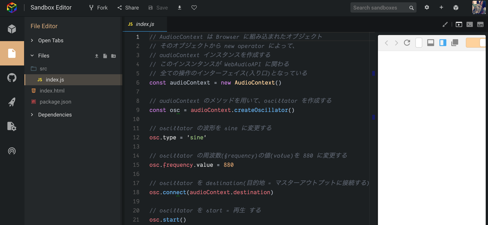

# Hello Sound

### 初めてのプログラミング

初めてプログラミング言語を学習する際には、慣習的に「Hello World」と呼ばれるタイプのコードを書くことになる。 "Hello World" とスクリーンに表示する一番シンプルなプログラムだ。

しかし本書は音楽家のための本なので、"Hello Sound" アプリケーションを作ることにしよう。実行するとすぐに音がなるシンプルなアプリケーションだ。

```javascript
const audioContext = new AudioContext()
const osc = audioContext.createOscillator()
osc.type = 'sine'
osc.frequency.value = 880
osc.connect(audioContext.destination)
osc.start()
```

このコードを実行すると、シンプルなサイン波が聞こえる。

実行するためには、以下のリンクをクリックしてほしい。ブラウザが別ページを開いて、オンライン上のエディターが表示される。するとすぐにサイン派が聞こえるはずだ。音量に注意して。

Demo \([https://codesandbox.io/s/zk178nl21p](https://codesandbox.io/s/zk178nl21p)\)



### Codesandbox について

Codesandbox はオンライン上でウェブアプリケーションを開発できるサービスだ。フロントエンドと呼ばれる領域の開発はほとんど全てできる。本書ではこれをつかって開発していく。これはプログラミング教育用のサービスが提供するダミーのエディターじゃない。本当の開発だ。開発したソースは、ダウンロードできるし、GitHub という大抵のエンジニアが使っている SNS のようなもので管理をすることもできる。とにかくリアルな開発だ。

使い方については既に動画を作っているので、これを参照してほしい。  
[https://www.udemy.com/react-redux-basic/learn/v4/t/lecture/9576680?start=0](https://www.udemy.com/react-redux-basic/learn/v4/t/lecture/9576680?start=0)

でも基本的には DAW と同じだ。左側に DAW のファイルブラウザのような部分がある。これもファイルブラウザだ。このアプリケーションで使う全てのファイルが階層化されて配置さている。その一つをクリックすれば、その内容が、中央のエディター部分に表示される。

試しに `index.html` とか `package.json` というファイルをダブルクリックしてみてほしい。中央のエディター部分が変化するはずだ。そしてその上のタブの部分に複数のファイルが表示されていることが示される。タブをクリックしても、そのファイルの内容に移動できる。

### ファイルとトラックの関係

各ファイルは、平たく言えば DAW のトラックのようなものだ。曲は複数のトラックから出来ている。もちろん簡単な 1 トラックだけでも曲は作れる。でも複雑さが上がってきたら、ベースとかドラムとかシンセとか毎に、別のトラックに分けた方がいいだろう。

同じことがプログラミングにもいえる。一つのファイルに全てのコードを書くこともできるが、そうしてしまうと、複数の別の役割を果たすコードが、同じファイルの中に配置されることになって煩雑だ。ベースのためだけにそれ専用のトラックを用意するように、ある役割を果たすコードはそれだけのために 1 ファイルを用意した方がいい。

### コメントによる説明

さて、コードを写して実行したのはいいものの、何をやっているのかは全くわからない。説明してほしい。と思っているはずだ。

少しコメントを追加してみた。コメントとは、プログラムの実行には全く影響しない、ただの説明だ。`//` を行の先頭に配置すると、その行はコメントになる。

```javascript
// AudiocContext は Browser に組み込まれたオブジェクト
// そのオブジェクトから new operator によって、
// audioContext インスタンスを作成する

// このインスンタンスが WebAudioAPI に関わる
// 全ての操作のインターフェイス(入り口)となっている
const audioContext = new AudioContext()

// audioContext のメソッドを用いて、oscillator を作成する
const osc = audioContext.createOscillator()

// oscillator の波形を sine に変更する
osc.type = 'sine'

// oscillator の周波数(frequency)の値(value)を 880 に変更する
osc.frequency.value = 880

// oscillator を destination(目的地 = マスターアウトプットに接続する)
osc.connect(audioContext.destination)

// oscillator を start = 再生 する
osc.start()
```

コメントによって追加された説明で、なんとなく雰囲気は見えてきたはずだ。でもしっかりとはわからない。次に章から本格的にプログラミングの専門用語を交えながら説明していく。

