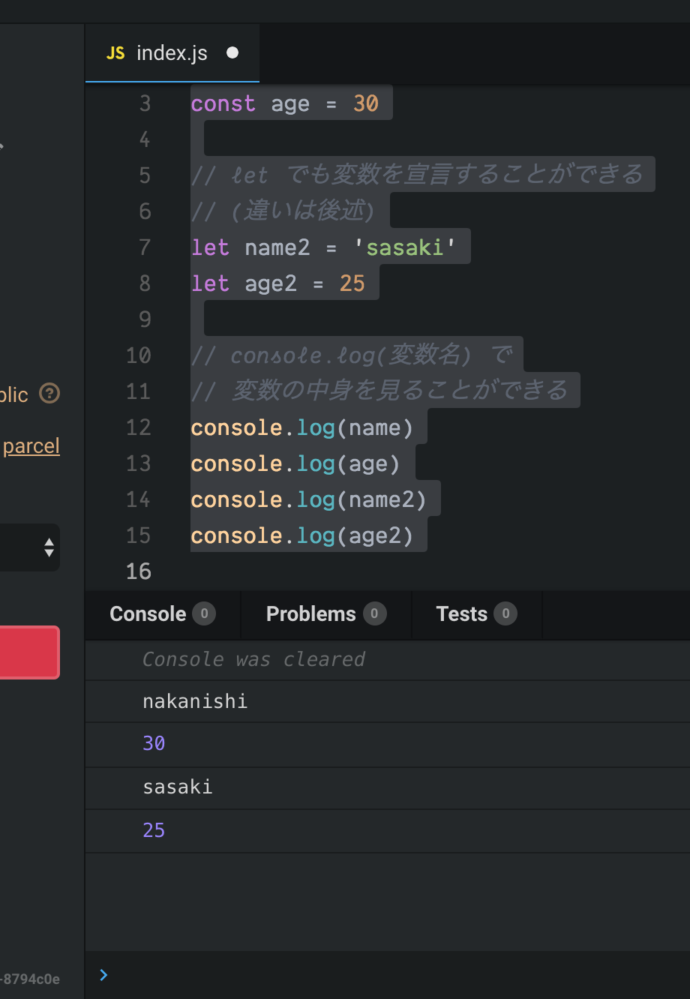

# 変数\(variable\)

音楽の比喩で説明するだけではなくて、そろそろプログラミングの専門用語を紹介しよう。

まずは「変数」\(variable\) という用語を覚えてほしい。変数というのは、値を保存する「箱」だ、と一般的に説明される。箱なのだから、まずは箱を「作る」指示をする必要がある。そして箱を作ったら、その箱に「値をしまう」指示も必要になるだろう。

具体的にどんなふうに使うのか、説明しよう。以下のコードを見てほしい。

```javascript
const audioContext = new AudioContext()
```

### 変数の宣言\(Declaring Variables\) = 箱を作る

`const` と書くことで、これから変数の箱を作ることを「宣言」する。その変数の箱の名前は「audioContext」と決めることにした。だから `const audioContext` と書いてある。この部分までで、 "audioContext" という「名前」の「箱」ができた。

### 代入\(Assignment\) = 値を箱にしまう

その後ろに続く `=` を含む部分が、箱に値を入れる過程だ。`audioContext` という箱に、`=` 以降の値をしまってやろうとしている。何を入れるかと言えば、`new AudioContext()` の実行結果だ。この実行がなんなのかは少し難しいので後で詳しく説明することにしよう。とにかく今覚えてほしいのは、実行した結果が、`=` という記号のおかげで、`audioContext` という箱の中に吸い込まれて、しまわれるということだ。変数の箱に値をしまうためには、`=` を使う。この箱に値をしまう作業を「代入」という。

### もっと簡単な例で

上の例は少し難しかったので、もっと簡単な例を見てみよう。

```javascript
// const で変数を宣言する
const name = 'nakanishi'
const age = 30

// let でも変数を宣言することができる
// (違いは後述)
let name2 = 'sasaki'
let age2 = 25

// console.log(変数名) で
// 変数の中身を見ることができる
console.log(name)
console.log(age)
console.log(name2)
console.log(age2)
```

### 文字列\(String\)

`'nakanishi'` は文字列を作っている。文字列は、まあ「文字だ」。

### 数字\(Number\)

`30` は数字を作っている。数字は、数字だ。

大事なのは、文字を作る場合には `'文字'` のようにシングルクオートで囲む必要があるが、数字の場合は `30` のように、囲む必要がないということだ。シングルクオート\(`'`\)の有無で、文字列かそうでないかを見分けている。

### let も変数を宣言するために用いる

もう一つ `let` も `const` と同じく変数を宣言するために使用できる。違いは後述する。

### console.log\(変数名\) で中身を表示する

`console.log(変数名)` とすることで、変数の中身を見ることができる。下の画像を見てほしい。Console というタブに値が表示されている。下の小さい矢印\(&gt;\)をクリックすると、このタブが表示される。



これで、変数\(variable\)、 変数の宣言に使う `const` と `let` 、それから文字列\(`'文字列'`\)、数字\(`30`\)を覚えた。

